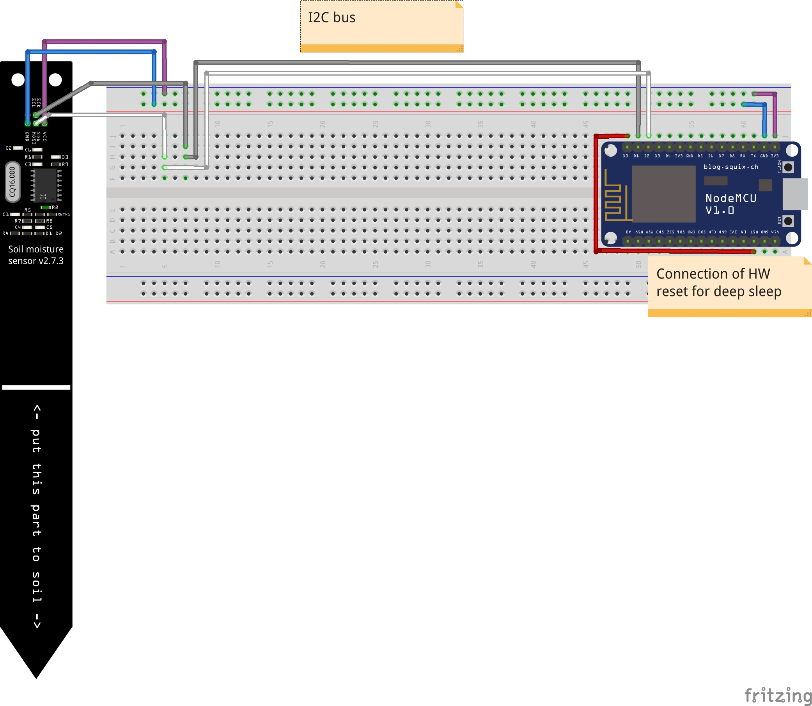

# Chirp I2C soil moisture sensor 
This readme describe how to setup and use the chirp standalone sensor with NodeMCU.
This sensor is a capacitive soil moisture sensor similar to Vegetronix VH400, but with digital i2c interface and of lower price.

* [Chirp! - the plant watering alarm](https://wemakethings.net/chirp/): capacitive soil moisture sensor. Original page incl. history and prototypes 
* [Chirp!@tindie](https://www.tindie.com/products/miceuz/chirp-plant-watering-alarm/): Where to buy 
* [I2C Soil moisture sensor](https://www.tindie.com/products/miceuz/i2c-soil-moisture-sensor/): Based on Chirp!, but as standalone realization with I2C interface.

## Requirements:
* I2C Soil moisture sensor (v2.7.5)
* Micropython for esp8266
    * [Download](http://micropython.org/download#esp8266) e.g. esp8266-20170612-v1.9.1.bin
    * Note1: With older versions of micropython I was not able to successfully read I2C registers.
    * Note2: The sensor is shipped without soldered cable
    * [Tutorial](https://docs.micropython.org/en/latest/esp8266/esp8266/tutorial/intro.html): Who to get started with micropython on esp8266
* [esptool](https://github.com/espressif/esptool/): How to deploy the micropython image on esp8266 is described in [micropython tutorial](https://docs.micropython.org/en/latest/esp8266/esp8266/tutorial/intro.html#deploying-the-firmware)
* [ampy](https://github.com/adafruit/ampy): Command line tool to perform file operations on esp8266 e.g. to upload python file.

## Remarks
### Adress of the chirp
Please keep the following reference from [I2C Soil moisture sensor](https://www.tindie.com/products/miceuz/i2c-soil-moisture-sensor/) in mind:
"**Do not hotplug the sensor into the active I2C bus** - address change command has no protection and this might result in a random number set as an address of the sensor. Use I2C scan sketch to find out the address if the sensor stops responding with proper values."

My chirp accidentally got the i2c adress 0x02. As the command ic2scan commonly starts scanning from 0x03, the sensor was not found.
However, it can properly be used with adress 0x02 or change to a new address by writing one byte to register 1.

## Layout of breadboard

Layout on how to connect chirp with NodeMCU. The i2c bus is connected to
* SCL: Pin 5 = D01
* SDA: Pin 4 = D02

## Deploy to esp8266

